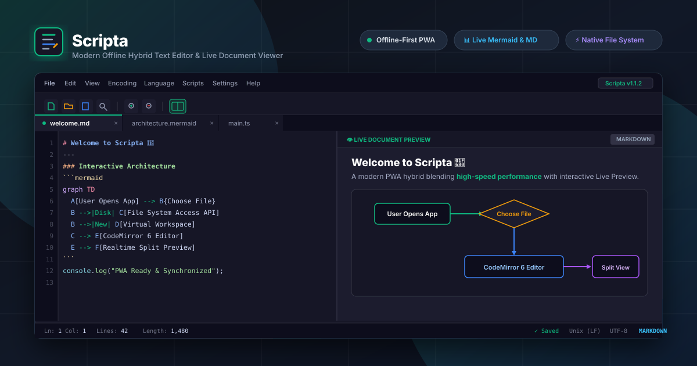

<div align="center">

  

# Scripta

**The Modern Hybrid Text Editor for the Web**

[](package.json)
[](LICENSE)
[](https://www.typescriptlang.org/)
[](https://react.dev/)
[](https://vitejs.dev/)
[](https://web.dev/progressive-web-apps/)

  <p align="center">
    <a href="https://scripta.trongajtt.com"><b>🌐 Launch App (scripta.trongajtt.com)</b></a> •
    <a href="#-key-features">Key Features</a> •
    <a href="#-tech-stack">Tech Stack</a> •
    <a href="#-getting-started">Getting Started</a> •
    <a href="#-documentation">Documentation</a>
  </p>

  <p align="center">
    
  </p>

</div>

---

## 🌟 Overview

**Scripta** is a high-performance, privacy-first web text & code editor inspired by the raw speed and utility of classic desktop tools, elevated by modern web capabilities. It merges zero-latency typing powered by **CodeMirror 6**, multi-format **Live Previews** (Markdown, Mermaid, SVG, HTML, Math, Python via Pyodide), native **File System Access API** disk integration, and local client-side state persistence.

Whether you need a quick notepad, an offline markdown notebook, a diagram designer, or a powerful script runner, Scripta delivers instantaneous startup with zero telemetry.

---

## ✨ Key Features

### 📑 Advanced Multi-Tab & Workspace System

- **Tab Management**: Pin (`Ctrl+Alt+P`), Lock (`Read-Only`), reorder with drag & drop, close saved tabs, or close to the right.
- **Multi-Workspace**: Group working contexts into isolated named workspaces with instant session switching.
- **Crash Recovery & Auto-Save**: Seamless session persistence powered by IndexedDB. Never lose uncommitted work on refresh or browser close.
- **Reopen Closed Files**: Quickly recover closed tabs with `Ctrl + Shift + T`.

### ⚡ Native Disk File I/O

- **File System Access API**: Open, edit, and save directly to your physical hard drive with `Ctrl + S` without file upload/download prompts.
- **Cross-Browser Fallback**: Automatic graceful degradation via Blob downloads and `<input type="file">` for unsupported browsers.
- **External Change Detection**: Live filesystem watchers alert you when opened files are modified by external applications.

### 🔖 Line Bookmarks & Jumper (New in v1.1.4)

- **Gutter Marker & Direct Click**: Toggle bookmarks directly by clicking on the dedicated editor gutter or pressing `Ctrl + F2`.
- **Wrap-Around Navigation**: Traverse through code marks using `F2` (Next) and `Shift + F2` (Previous).
- **Session-Preserved**: Bookmarks automatically serialize into your tab session in IndexedDB.

### 🎯 Dual-Zone Drag & Drop (New in v1.1.4)

- Drag any file from your OS into the workspace with smart dual drop zones:
  - **Left Zone (Open as New Tab)**: Spawns independent tabs with linked file handles.
  - **Right Zone (Append to Cursor)**: Decodes and injects text directly at your cursor.

### 📊 Real-Time Interactive Live Previews

- **Markdown & GitHub Flavored Tables**: Formatted preview sanitized via `DOMPurify` with real-time sync.
- **Mermaid.js Diagrams**: Interactive flowcharts, sequence, Gantt, ER, class diagrams with vector SVG export.
- **HTML & CSS Live Runner**: Interactive sandboxed sandbox iframe for web snippets.
- **Python WASM (Pyodide)**: Run Python scripts directly in-browser using WebAssembly.
- **Vector SVG & Image Viewer**: Inspect raw vector SVGs or preview `.png`, `.jpg`, `.webp`, `.gif` with zoom & pan.

### ⚙️ Script Automation & Custom Macros

- **Client-Side Script Engine**: Write custom JavaScript automation functions to manipulate text buffers, perform batch transformations, and execute custom macros safely in Web Workers.
- **Built-in Sample Runner**: Test and inspect your transformations in real-time before applying.

### 🎨 Themes & Modern Ergonomics

- **Curated Themes**: Catppuccin Mocha slate, Pure Dark, Elegant Light, and automatic OS system matching.
- **Encoding Mastery**: Support for UTF-8, UTF-16LE, Windows-1252, Shift-JIS, GBK, Big5, and automatic line ending conversion (`CRLF` $\leftrightarrow$ `LF`).
- **Comprehensive Status Bar**: Real-time cursor coordinates (`Ln`, `Col`, `Sel`), document metrics (`Lines`, `Length`, `Size`), encoding, and active grammar.
- **PWA & Offline Ready**: Installable to desktop/mobile with full offline capabilities through Workbox service workers.

---

## ⌨️ Popular Keyboard Shortcuts

| Shortcut              | Action                           |
| :-------------------- | :------------------------------- |
| `Ctrl + N`            | Create a new tab                 |
| `Ctrl + O`            | Open file from disk              |
| `Ctrl + S`            | Save file directly to disk       |
| `Ctrl + Shift + S`    | Save As...                       |
| `Ctrl + Shift + T`    | Reopen last closed tab           |
| `Ctrl + F`            | Find & Replace dialog            |
| `Ctrl + F2`           | Toggle bookmark on current line  |
| `F2` / `Shift + F2`   | Jump to Next / Previous bookmark |
| `Alt + D`             | Duplicate current line           |
| `Alt + Shift + L`     | Delete line                      |
| `Alt + ↑` / `Alt + ↓` | Move line up / down              |
| `Alt + /`             | Toggle comment                   |

---

## 🛠️ Tech Stack

- **Framework**: [React 19](https://react.dev/) + [Vite 8](https://vitejs.dev/) + [TypeScript 5.9](https://www.typescriptlang.org/) (Strict mode, `verbatimModuleSyntax`)
- **Editor Engine**: [CodeMirror 6](https://codemirror.net/) (Dynamic Compartments for theme, font size, language & syntax highlighting)
- **Styling**: [Tailwind CSS v4](https://tailwindcss.com/) + Semantic CSS Custom Properties
- **State Management**: [Zustand](https://github.com/pmndrs/zustand)
- **Persistence Layer**: [idb](https://github.com/jakearchibald/idb) (IndexedDB Wrapper)
- **Document Engines**: [Marked](https://marked.js.org/) + [Mermaid](https://mermaid.js.org/) + [DOMPurify](https://github.com/cure53/DOMPurify) + [Pyodide](https://pyodide.org/)
- **Icons**: [Lucide React](https://lucide.dev/)
- **PWA Runtime**: [vite-plugin-pwa](https://vite-pwa-org.netlify.app/) + Workbox

---

## 🚀 Getting Started

### Prerequisites

- **Node.js**: `v20.x` or higher (`Node 22+` recommended)
- **Package Manager**: `pnpm >= 9.x` (`pnpm 12` used)

### Installation

```bash
# 1. Clone repository
git clone https://github.com/TrongAJTT/scripta.git
cd scripta

# 2. Install dependencies
pnpm install

# 3. Start local development server
pnpm dev
```

The application will be running at `http://localhost:5173/`.

### Building & Production Checks

```bash
# Run strict linter checks
pnpm lint

# Compile TypeScript and create production PWA bundle
pnpm build

# Preview production build locally
pnpm preview
```

---

## 📖 Architecture & Documentation

For in-depth architectural guides and developer notes:

- 🏛️ [System Architecture](docs/ARCHITECTURE.md) - Internal design, state flow, and CodeMirror extension compartments.
- 💡 [Features & User Guide](docs/FEATURES_USER_GUIDE.md) - Deep dive into all editor capabilities and shortcuts.
- 🛠️ [Development & Extension Guide](docs/DEVELOPMENT_GUIDE.md) - Guide on adding new preview adapters and language support.
- ☁️ [Deployment Guide](docs/DEPLOYMENT_CLOUDFLARE.md) - Production deployment setup on Cloudflare Pages / Vercel.

---

## 🤝 Contributing & Guidelines

Contributions are welcome! Please make sure to check [AGENTS.md](AGENTS.md) for architectural rules, coding standards, and commit message conventions before submitting PRs.

```bash
git checkout -b feat/your-feature-name
# Commit with conventional commit format: feat: <description>
git commit -m "feat(editor): add cool new capability"
```

---

## 💖 Support the Project

If you find Scripta useful, consider starring the repository ⭐ or supporting continued development:

- ☕ [Buy Me A Coffee](https://buymeacoffee.com/trongajtt)
- 💖 [GitHub Sponsors](https://github.com/sponsors/TrongAJTT)
- 🌐 [Author Website & Donate](https://www.trongajtt.com/donate)

---

## 📄 License
 
Distributed under the **Apache License 2.0**. See [`LICENSE`](LICENSE) for more information.
 
<div align="center">
  <sub>Crafted with ❤️ by <a href="https://github.com/TrongAJTT">TrongAJTT</a> and contributors.</sub>
</div>
