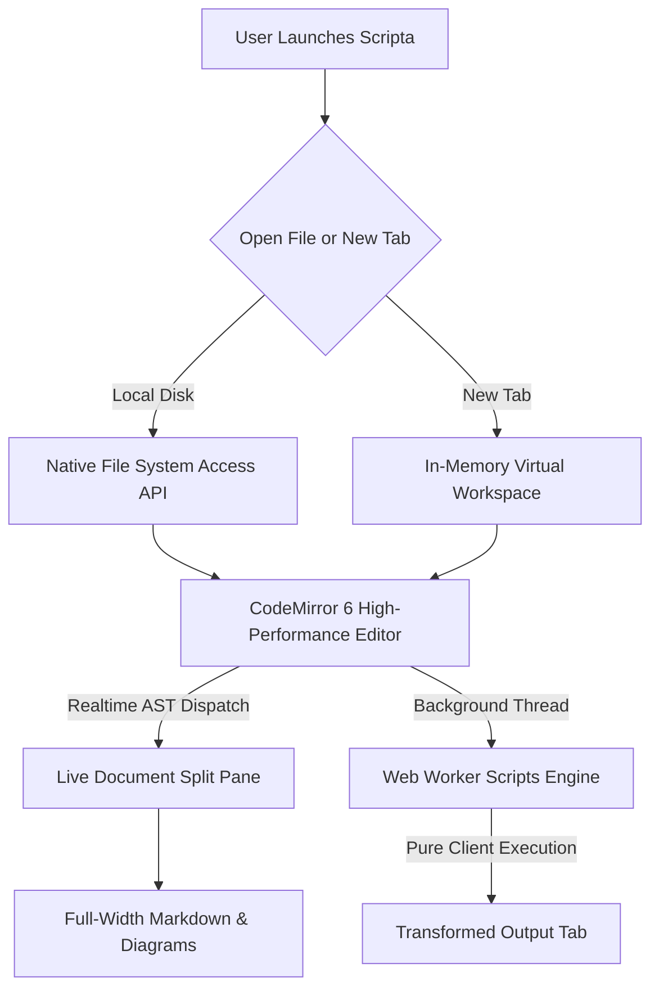

# Welcome to Scripta 🚀

A high-performance hybrid text editor and live document viewer built for the modern web. It blends lightning-fast responsiveness with offline PWA support, live split-pane previews, and an extensible background automation scripts engine.

---

### 🌟 Key Capabilities:

- ⚡ **Native File System Access**: Open, edit, and save files directly on your local storage with zero upload latency.
- 📑 **Multi-Tab Workflow**: Work across dozens of files simultaneously with real-time modified indicators and drag-and-drop tab reordering.
- 🖥️ **Full-Width Live Document Previews**:
  - **Markdown**: Extended GitHub-flavored markdown rendered across full width without narrow containers.
  - **Mermaid Diagrams**: Interactive flowcharts, sequence diagrams, state machines, and Gantt charts.
  - **Vector Graphics & Media**: Real-time SVG rendering and image previews.
  - **Web Code**: Live HTML & CSS previews.
  - **Data Inspection**: Interactive collapsible JSON tree viewer.
- 🧰 **Automated Scripting Engine**:
  - Background Web Worker architecture ensures your UI remains butter-smooth during heavy text processing.
  - Pre-packaged templates: Color Code Converter, Password-based Cipher, Delimiter/Separator Inserter, Line Filter, Case Converter, JSON Minifier/Prettifier, and more.
- 📱 **Offline-First PWA**: Fully functional offline without external network or server dependencies.
- 🔒 **Zero Telemetry & 100% Privacy**: All operations occur entirely inside your browser sandbox.

---

### 🎨 Live Mermaid Diagram Demo:

---

### ⌨️ Useful Keyboard Shortcuts:

| Action                | Shortcut           |
| :-------------------- | :----------------- |
| **New File**          | `Alt + N`          |
| **Open File**         | `Ctrl + O`         |
| **Save File**         | `Ctrl + S`         |
| **Save As**           | `Ctrl + Shift + S` |
| **Close Tab**         | `Alt + W`          |
| **Find & Replace**    | `Ctrl + F`         |
| **Duplicate Line**    | `Ctrl + D`         |
| **Toggle Fullscreen** | `F11`              |

---

### 📜 Legal & Privacy Documentation:

- [Terms of Service](terms.md)
- [Privacy Policy](policy.md)

_Tip: Press **Ctrl+O** to open a file from your computer or drag & drop files anywhere onto the window!_
